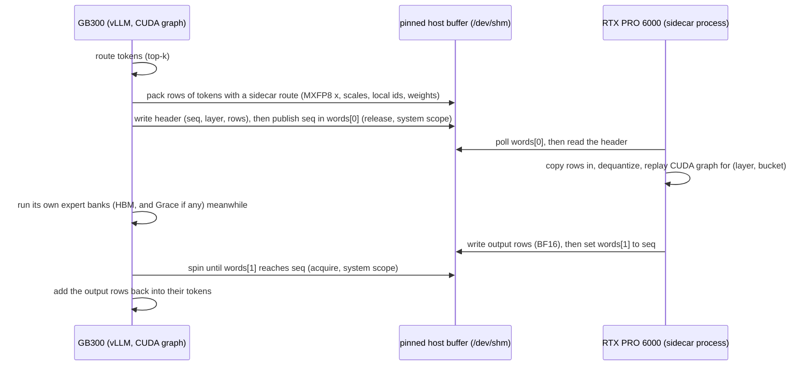

# The RTX PRO 6000 sidecar ("peer tier")

A DGX Station GB300 can also hold a workstation GPU. Ours has an RTX PRO 6000 Blackwell Max-Q, with 96 GB on
PCIe. The two GPUs share no NVLink, and P2P is not enabled between them. They share only host memory.

MoE models that don't fit in the GB300's HBM normally leave their least-used experts in Grace memory, where
the GB300 reads them over NVLink-C2C. The sidecar gives those experts a second home instead: they live in the
RTX PRO 6000's VRAM, and the RTX PRO 6000 computes them. For each MoE layer, the GB300 sends only the tokens
that route to sidecar experts, and gets back their partial outputs.

The design serves two models here:

| | DeepSeek-V4.1-Flash ([M3](../deepseek-v4.1-flash/m3/)) | MiMo-V2.6-Pro ([three-tier](../mimo-v2.6-pro/)) |
|---|---|---|
| GB300 hot experts | MegaMoE, 285 per layer | Marlin or TRT-LLM, ranked globally (152.8 GiB) |
| sidecar experts | 99 per layer × 40 layers = 3,960 | 4,829 over 69 layers (36–129 per layer) |
| everything else | nothing: no routed expert in Grace | 13,486 experts read from Grace |
| sidecar share of decode routes | about 5% (out-of-sample, *notes*) | 17.3% |
| GB300 wait on the sidecar | 0.07–0.14 ms per pass at C8/C16 | 0.18–0.81 ms per pass, C1–C16 (under 1%) |

## One MoE layer

Four properties matter:

- **Graph-safe.** Every GB300-side step is a device kernel with no host synchronization: the pack, publish,
  wait and scatter-add kernels. vLLM captures the whole path in its CUDA graphs, and the sequence counter
  lives on the device.
- **Only rows that need the sidecar cross the bus.** A token is packed only if at least one of its top-k
  routes goes to a sidecar expert. A layer with no such tokens skips the wait; the sidecar still
  acknowledges the sequence number.
- **Overlap.** The GB300 publishes before running its own experts, so the sidecar computes concurrently.
- **Fails open, loudly.** The wait has a spin limit. If the sidecar is missing, the layer drops the sidecar's
  contribution and increments a timeout counter. It does not hang. Watch the counter: a timeout means wrong
  outputs.

## Buffer layout

One file in `/dev/shm`, mapped by both processes and registered with `cudaHostRegister(Mapped | Portable)`:

| offset | content |
|---|---|
| 0 | global words (int64): [0] published seq, [1] completed seq, [2] timeouts, [3] rows sent, [4] tokens seen, [5] ns the GB300 spent waiting, [6] waits |
| 4,096 | header (int64): [0] seq, [1] layer, [2] rows, [3] tokens |
| 8,192 | `MAX_ROWS × H` MXFP8 activations (E4M3 bytes) |
| … | `MAX_ROWS × H/32` E8M0 scales, `MAX_ROWS × k` int32 local expert ids (−1 = not a sidecar route), `MAX_ROWS × k` fp32 weights |
| … | `MAX_ROWS × H` BF16 output rows |

Words 5 and 6 are timed on the GB300 with `%globaltimer` inside the wait kernel. They are how the wait is
measured under CUDA graphs, where the torch profiler shows no kernel events
([`measure_wait.py`](../deepseek-v4.1-flash/m3/tools/measure_wait.py),
[`peer_wait.py`](../mimo-v2.6-pro/bench/peer_wait.py)).

## The sidecar process

- Loads its experts straight from the checkpoint's safetensors. Local id = position in the rowmap's
  cold or peer list, the same order the GB300 uses.
- Prepares them for b12x's SM120 fused MoE in `w4a8_mx` mode: MXFP4 weights, MXFP8 activations.
- Captures one CUDA graph per (layer, row bucket), with buckets from 1 to 8,192 rows. Buckets of up to 64 rows
  are copied whole inside the graph, which gives one replay per decode layer. The GB300 masks the padding
  rows' routes to −1.
- Before serving, the MiMo sidecar self-tests the exact serving path against a float32 reference built from
  freshly read checkpoint bytes. The path includes shared-buffer writes, copies, dequant and replay. The
  sidecar refuses to start below a cosine threshold.
- Busy-polls the header from Python on one CPU core. It writes per-bucket latency to `peer_stats.json` and
  accepts a live bucket override from `peer_buckets.json`.

Mean sidecar time per call is 74–91 µs for 1 row, about 150 µs for 16 rows, and 4.0–5.5 ms for 8,192 rows.
That covers copy-in, replay and copy-out. The b12x fused MoE is what makes prefill-sized batches viable. For
512 tokens on DeepSeek's cold experts it takes 1.08 ms; the Triton GEMV used by the first version takes 10.6 ms.

## History

1. **Peer v1** handled T ≤ 64 only, sent the whole batch rather than compacted rows, and used a Triton GEMV
   sidecar
   ([`../deepseek-v4.1-flash/overnight/peer/`](../deepseek-v4.1-flash/overnight/peer/)). It first ran under
   Al-ENGR's v20 recipe. There it lifted catid C16 from 821 to 1,154 tok/s.
2. **Peer v2** handles any batch size with compacted rows, using b12x ([`../deepseek-v4.1-flash/m3/`](../deepseek-v4.1-flash/m3/)).
3. **MiMo port** changes the constants (H 6144, I 2048, top-8, SiLU without clamp, 69 layers) and adds the
   self-test and a fused three-kernel send ([`../mimo-v2.6-pro/hook/`](../mimo-v2.6-pro/hook/)).

## Porting to another model

Change the constants in the protocol module (`HIDDEN`, `TOPK`, `MAX_ROWS`) and in the sidecar (intermediate
size, activation, MoE layer ids, checkpoint tensor names). You also need a GB300-side hook that splits each
MoE layer's experts into banks and calls `send` / `finish`. Budget the RTX PRO 6000 at about 90 GiB of MXFP4
experts after graphs and scratch. Share one b12x `PreparationSession` across layers; each session allocates a
256 MiB L2-flush buffer. Prepare the layer with the most experts first. Validate with an in-server cross-check
before trusting any quality number: see the dequant bug in [M3 DETAILS](../deepseek-v4.1-flash/m3/DETAILS.md#bugs-worth-knowing-about).
